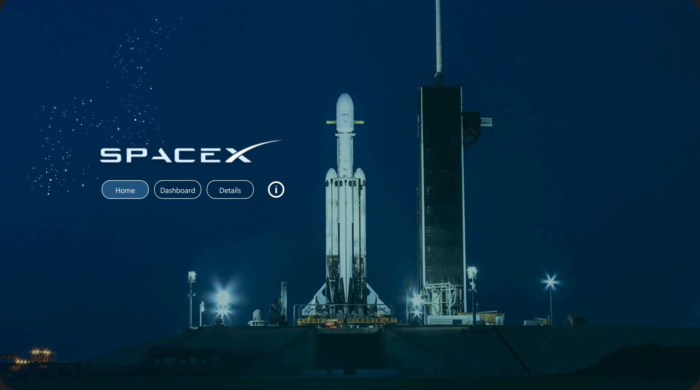
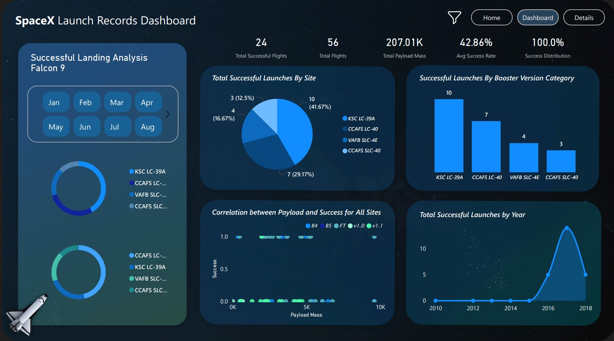
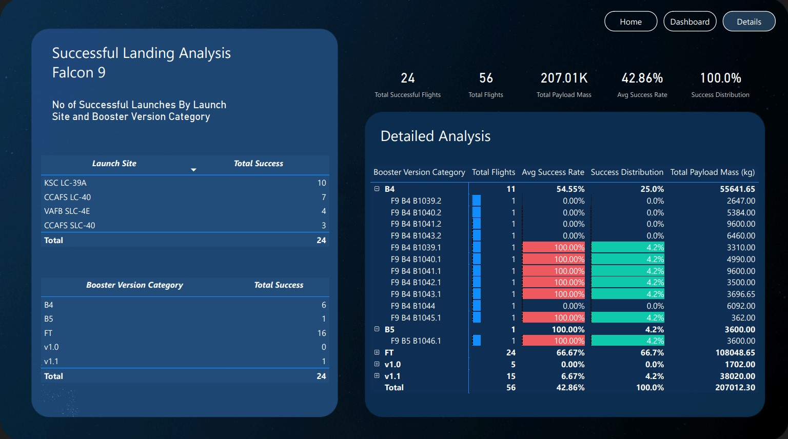
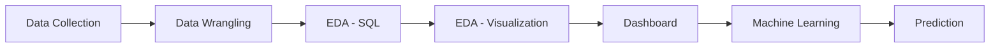

# 🚀 SpaceX Falcon 9 Landing Prediction

<p align="center">
  
  
  
  
</p>

---

## 📌 Project Overview

SpaceX reduced launch costs drastically using reusable rockets.
This project predicts **whether the Falcon 9 first stage will successfully land** using historical launch data.

💡 The goal is to help:

* Estimate launch cost efficiency
* Identify key success factors
* Support decision-making with data

---

## 🎯 Key Highlights

✔ End-to-end Data Science project
✔ API + Web Scraping data collection
✔ SQL + Python EDA
✔ Interactive Dashboard (Dash + Plotly & Power BI)
✔ Machine Learning model with **91.6% accuracy**

---

## 🧠 Tech Stack

* Python (Pandas, NumPy)
* Scikit-learn
* SQL
* Plotly Dash
* Power BI
* Folium (Maps)

---

## 📊 Dashboard Preview

### Home



### Dashboard



### Details



---

## 🔍 Project Workflow



---

## 📦 Dataset

* SpaceX API
* Wikipedia Scraping

---

## ⚙️ Machine Learning Models

| Model               | Accuracy  |
| ------------------- | --------- |
| Logistic Regression | 84.6%     |
| SVM                 | 84.8%     |
| KNN                 | 84.8%     |
| 🌟 Decision Tree    | **91.6%** |

---

## 📈 Key Insights

* Payload mass has **low impact** on success
* Launch site significantly affects outcomes
* Success rate improved over time
* Decision Tree performed best

---

## 📁 Project Structure

```
├── 1 - Collecting the data (API & WEB SCRAPE)/
├── 2 - Data Wrangling/
├── 3 - Exploratory Data Analysis using SQL/
├── 4 - Python EDA with Visualization/
├── 5 - (Optional) - Interactive Visuals with Folium/           
├── 6 - Interactive Dashboard with Plotly Dash/
├── 7 - Predictive Analysis/
├── 8 - Powerbi Dashboard/
├── Flowcharts/
├── assets/
├── Project Report.pdf
└── README.md
```

---

## 🤝 Connect With Me

💼 LinkedIn:
https://www.linkedin.com/in/shehraz-sarwar-ghouri-321394247/

---

## ⭐ Support

If you like this project, give it a ⭐ on GitHub!

---

<p align="center">
  Made with ❤️ by <b>Shehraz Sarwar</b>
</p>
